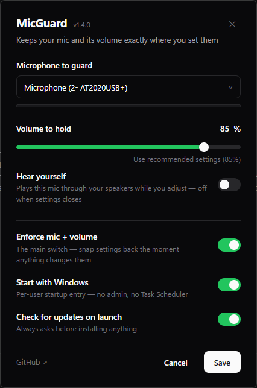

<div align="center">


# MicGuard

**Keeps your default mic and its volume exactly where you set them.**

Windows (and games like **Black Ops 3**) love to silently change your default
microphone and its recording volume. MicGuard sits in your tray and snaps both
back **the instant** anything touches them — measured restore time ~50 ms.



</div>

---

## Install

1. Download `MicGuard.exe` from the **[latest release](../../releases/latest)**.
2. Put it somewhere permanent (e.g. `Documents\MicGuard\`) and double-click it.
3. Done. First launch auto-selects the mic that's currently your default +
   default-communications device and opens Settings so you can pick the volume
   to hold and whether to start with Windows.

> [!NOTE]
> Windows SmartScreen may warn because the exe is unsigned — click
> **More info → Run anyway**. Needs the WebView2 runtime for the settings
> window (already on every Windows 11 PC and any PC with Edge).

## What it does

- 🎯 **Holds your default mic AND your default output** — if anything changes
  the default device (any role: Default Device *and* Default Communications
  Device), it's changed back immediately, for both capture and render.
- 🔁 **Priority fallback lists** — rank multiple mics/outputs; if your top
  pick disconnects, MicGuard falls back to the next one in line and switches
  straight back the instant your top pick reconnects. No more "Windows picked
  some random mic and forgot to switch back."
- 🗂️ **Named profiles** — bundle a mic list + output list under a name (e.g.
  "Gaming", "Streaming") and switch between them from the tray menu.
- 🔊 **Holds your mic volume** — BO3, Discord, Windows Update, anything moves
  the level → restored in ~50 ms. Unmutes too. Output volume can be held the
  same way per-device, or left alone so your volume keys keep working.
- 🔔 **Fallback alerts** — a small, no-focus-stealing popup tells you when a
  device drops out and again when it's back, without interrupting whatever
  you're doing (games included).
- ⌨️ **Volume hotkeys with an on-screen display** *(off by default)* — global
  shortcuts for system, per-app, or the active window's volume (e.g. bump
  Discord without alt-tabbing), with a game-safe OSD that never steals focus.
- 🎚️ **Mixer popup with boost-past-100%** — a dedicated hotkey (default
  `Shift+F3` on fresh installs) pops a small gkey-style mixer over your game;
  digits or arrows pick a row (arrow-key mode is a setting) and nudge it, it
  scrolls through every app currently playing audio, bars pulse with live
  levels, `M` mutes the selected row, and boosting an app past 100% ducks
  the game (or everything else) to make room, all without alt-tabbing.
- 🎙️ **Mic EQ (optional extension)** — one guided setup unlocks real gain
  boost (past your driver's max) and bass boost on your mic, saved per
  profile, applied instantly. Powered by Equalizer APO.
- ⚡ **Event-driven, ~0% CPU** — no polling loops. It subscribes to Windows
  Core Audio change events and sleeps otherwise.
- 🖱️ **Left-click the tray icon** → Settings. Right-click → full menu
  (pause enforcement, switch profiles, re-apply now, check for updates,
  uninstall, quit).
- 🚀 **Start with Windows** via a per-user registry Run entry — no Task
  Scheduler, no services, no admin rights.
- 🔔 **Updates ask first, never act silently** — it checks GitHub Releases on
  launch; you decide. If an in-place update fails it opens this releases page
  so you can grab the exe manually.
- 🧹 **Clean uninstall from the tray** — removes the startup entry, its
  settings folder, and the exe itself. Zero leftovers.

## Footprint

| Path | Purpose |
|---|---|
| `%APPDATA%\MicGuard\config.json` | settings |
| `%APPDATA%\MicGuard\micguard.log` | small log |
| `HKCU\...\CurrentVersion\Run\MicGuard` | startup entry (only if enabled) |

That's everything. No installer, no services, no telemetry.

## Building from source

```powershell
git clone https://github.com/Bristopher/MicGuard
cd MicGuard
uv sync
uv run pythonw micguard.py     # run it
.\release.ps1                  # maintainers: bump + build + tag + publish
```

Full guide: [Docs/Development/Build-and-Release.md](Docs/Development/Build-and-Release.md)

## How it works

One Python file. `pycaw`/`comtypes` register Core Audio callbacks
(`IAudioEndpointVolumeCallback` for volume, `IMMNotificationClient` for device
changes); any event wakes a single enforcement thread that re-asserts the
configured device (via the same `IPolicyConfig` COM interface
SoundSwitch/EarTrumpet use) and volume. A slow 15-second watchdog backstops
missed events — that's the only "polling", and it's one COM call. The UI is
real HTML/CSS rendered by Windows' built-in WebView2 (frameless pywebview
windows — pixel-level styling without shipping Electron); the whole thing
compiles to a single exe with PyInstaller.

Architecture deep-dive: [Docs/Architecture.md](Docs/Architecture.md)
